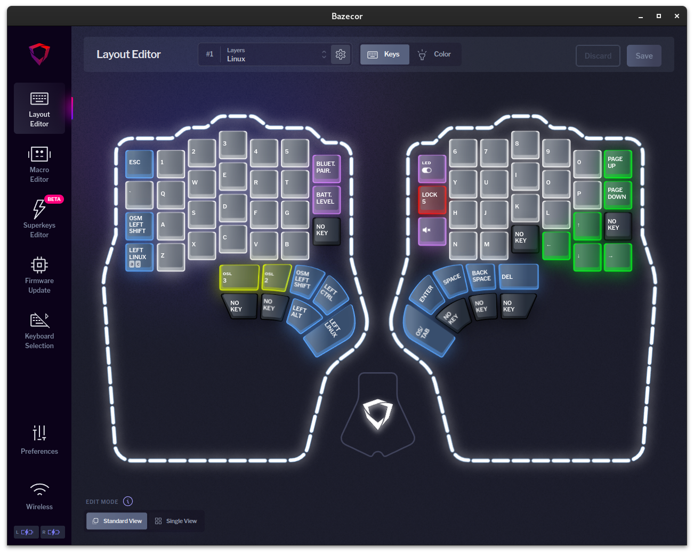

# Dygma Defy

## Layers
I have two different layers I use as base layers - Linux and MacOS. My attempt here is to make the shortcuts between the two OS's as similar as possible. I use one of the inside keys on the right keyboard to switch between the two layers (`Lock 5` on the linux layer, `Lock 1` on the macos layer). By using `lock` keys I can set several of the thumbkeys to `transparent` on the other lays so they inherit whatever the setting was on the base layer.

For example, on the linux layer, the big thumbkey on the left side is `left linux` and the thumbkey to its left and up is `left ctrl`. On the macos layer, those two are swapped. So, if I want to copy something (ctrl+c on linux, cmd+c on macos), the motions are identical. When I go to one of the other layers (symbols, numbers and functions) from the linux layer, the big thumbkey is still `left linux`. However, if I go to one of those other layers from the macos layer, the big thumbkey is `left ctrl`.

I also use three of the left thumbkeys to go to the three layers (Symbols, Numbers and functions) using one shot layer keys, and they are set to transparent on those three other layers. If I came from the linux layer, pressing those buttons again will return me to the linux layer. If I came from the macos layer, pressing those buttons again will return me to the macos layer.

### Linux
This is the base layer I use with Linux (and Windows) systems. The modifier keys are set to make shortcuts easy for me. There is also a `lock` button that will switch to the `MacOS` layer that is very similar, but with the modifier keys arranged differently to make the shortcut motions as similar as possible to linux.

`shift` and `space` are the two most frequently used keys for me, so I put them in the default thumb positions. For some reason, I always press the space key with my right thumb on regular keyboards, so I only have a space key on the right side.



[Linux layer](layers/Linux.json)

### MacOS
This layer is nearly identical to the linux layer, but with the modifier keys slightly modified to make shortcut motions as similar as possible.


[MacOS layer](layers/MacOS.json)

### Symbols
After regular letters, symbols are the next most frequently used keys for me. The ctrl, alt, super/os keys are set to `transparent` so they match the base layer you are coming from (Linux or MacOS).


[Symbols layer](layers/Symbols.json)

### Numbers and functions
I like having a number pad, so this layer mimics that for me. I also put all of the function keys on the left side so they are easy to use.


[Numbers and functions layer](layers/Numbers%20and%20functions.json)

## Extra Configuration

### Linux
I use the Gnome desktop environment and needed to create a few things to make my life easier running [Bazecor](https://github.com/Dygmalab/Bazecor/releases).

#### AppImage
Initially, I ran the AppImage file from my Downloads folder, but this felt klunky to me. Instead, I created a `~/Dygma/versions` folder and moved the AppImage file there. I then created a symbolic link to it in my `~/.local/bin` folder, which is already in my `PATH`.

```sh
mkdir -p ~/Dygma/versions
mv ~/Downloads/Bazecor-1.3.11-x64.AppImage ~/Dygma/versions/.
ln -s ~/Dygma/versions/Bazecor-1.3.11-x64.AppImage ~/.local/bin/bazecor
```

When there is a new version of bazecor, I download it to ~/Dygma/versions and update the ~/.local/bin/bazecor symlink to point to the new version. If something goes wrong with the new version, I can always point the symlink back to the old version.

```sh
rm ~/.local/bin/bazecor
ln -s ~/Dygma/versions/Bazecor-<new version>-x64.AppImage ~/.local/bin/bazecor
```

#### Icon
I saved a copy of the bazecor icon and stored it in `~/.local/share/icons/Bazecor/bazecor.png`.


#### Desktop file
I created a `~/.local/share/applications/bazecor.desktop` file so I can use the Gnome menu to open bazecor. If you copy this file, you'll need to modify the `Exec` and `Icon` lines to match your environment.

[bazecor.desktop](bazecor.desktop)
```ini
[Desktop Entry]
Name=Bazecor
Exec=/home/owen/.local/bin/bazecor
Terminal=false
Type=Application
Icon=/home/owen/.local/share/icons/Bazecor/bazecor.png
Comment=Dygma Defy Configuration Application
MimeType=x-scheme-handler/bazecor;x-scheme-handler/bazecor;
Categories=Utilities;
```
